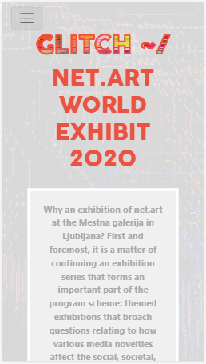
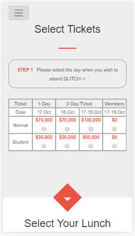

# A net.art gallery exhibit page

> This web page is based on a template for a conference page. I've adapted that design to promote an art gallery exhibit. I've decided to go with the theme of net.art for this project. Glitch art is a recurring theme in this adaptation. The design is responsive: it works both on desktop and mobile devices.

## Video presentation

## Main page, desktop view

## Main page, mobile view

## About page, desktop view

## About page, mobile view

## Tickets sale page, desktop view

## Tickets sale page, mobile view

## Built With

- CSS3
- HTML5
- CSS Flexbox
- CSS Grid
- Twitter Bootstrap 4

## Live Demo

[Live Demo Link](https://rawcdn.githack.com/voscarmv/conference_page/5c815064b9cac433a3464f5ab89b9a39110f4a64/pages/index.html)

## Usage

The page is for design showcasing only. None of the elements or interfaces in it really work.

## Author

**Oscar Mier**
- Github: [@voscarmv](https://github.com/voscarmv)
- Twitter: [@voscarmv](https://twitter.com/voscarmv)
- Linkedin: [Oscar Mier](https://www.linkedin.com/in/oscar-mier-072984196/) 

## 🤝 Contributing

Contributions, issues and feature requests are welcome!

Feel free to check the [issues page](../../issues/).

## Show your support

Give a ⭐️ if you like this project!

## Acknowledgments

- The design guideline for this project was created by [Cindy Shin](http://www.cindyisworking.com/) and is available on [behance](https://www.behance.net/gallery/29845175/CC-Global-Summit-2015).

### Images

The images used for this project have been released for non-commercial use, and are available online here:

- [https://www.flickr.com/photos/hellocatfood/11287069044/](https://www.flickr.com/photos/hellocatfood/11287069044/)
- [https://commons.wikimedia.org/wiki/File:Glitch_Art.jpg](https://commons.wikimedia.org/wiki/File:Glitch_Art.jpg)
- [https://www.flaticon.com/free-icon/dish_857718?term=dinner&page=1&position=6](https://www.flaticon.com/free-icon/dish_857718?term=dinner&page=1&position=6)
- [https://www.flaticon.com/free-icon/dish_857718?term=dinner&page=1&position=6](https://www.flaticon.com/free-icon/dish_857718?term=dinner&page=1&position=6)
- [https://www.flaticon.com/free-icon/image_2467800?term=picture&page=1&position=22](https://www.flaticon.com/free-icon/image_2467800?term=picture&page=1&position=22)
- [https://www.flaticon.com/free-icon/drinks_2474308?term=party&page=1&position=16](https://www.flaticon.com/free-icon/drinks_2474308?term=party&page=1&position=16)
- [https://www.flaticon.com/free-icon/typing_1670530](https://www.flaticon.com/free-icon/typing_1670530)
- [https://www.flickr.com/photos/oskay/6634598175](https://www.flickr.com/photos/oskay/6634598175)
- [https://www.flickr.com/photos/museres/5430514383/](https://www.flickr.com/photos/museres/5430514383/)
- [https://www.flaticon.com/free-icon/twitter_733579](https://www.flaticon.com/free-icon/twitter_733579)
- [https://www.flaticon.com/free-icon/facebook_733547](https://www.flaticon.com/free-icon/facebook_733547)
- [https://www.flickr.com/photos/marcwathieu/2992979472](https://www.flickr.com/photos/marcwathieu/2992979472)

## 📝 License

This project is [MIT](https://opensource.org/licenses/MIT) licensed.
